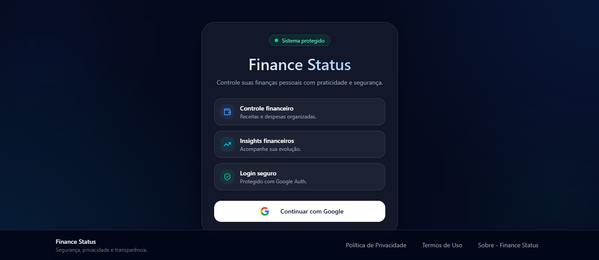

# 💰 Finance Status

Um dashboard financeiro pessoal, moderno e interativo — desenvolvido com **React + TailwindCSS + Firebase**. Acompanhe entradas, saídas, saldo e gráficos em tempo real, com dados isolados por conta Google.

🔗 [Acesse o projeto ao vivo](https://finance-status.vercel.app/)



---

## ✨ Funcionalidades

- Autenticação com Google (cada usuário vê apenas seus próprios dados)
- Foto de perfil vinculada à conta Google exibida na navegação
- Cadastro de transações por categoria (Alimentação, Transporte, Saúde, Educação, Lazer, Contas Fixas, Outros)
- Visualização de saldo, total de entradas e total de saídas
- Exclusão de transações com atualização imediata do saldo
- Filtro por tipo (Entradas / Saídas / Todas / por Categoria / Mais Antigas)
- **Filtro por mês** — exibe apenas transações do mês selecionado
- **Filtros combinados** — categoria + período aplicados simultaneamente
- Gráfico de área com evolução do saldo ao longo do tempo
- Gráfico de pizza com distribuição por categoria e percentual de cada uma
- Ambos os gráficos respondem aos filtros ativos em tempo real
- Exportação do histórico filtrado em PDF
- Responsividade total (Mobile First)
- Menu hambúrguer em mobile com navegação completa

---

## 🚀 Tecnologias

- React JS
- TailwindCSS
- Firebase Firestore + Authentication
- Recharts (gráficos interativos)
- react-pdf (exportação em PDF)
- react-number-format (formatação de moeda)
- React Router DOM
- shadcn/ui (componentes de interface)
- React Icons

---

## 🧠 Como funciona

- Ao acessar o app, o usuário faz login com Google. Os dados são carregados do **Firestore** e isolados por UID — nenhum usuário acessa os dados de outro.
- Na **Página Inicial**, é possível adicionar transações informando valor, categoria e tipo (entrada ou saída). O saldo é recalculado automaticamente.
- Na **Página de Transações**, o histórico completo é exibido com filtros por tipo, categoria e mês. Os gráficos refletem os filtros ativos em tempo real.
- O botão **Gerar PDF** exporta apenas as transações visíveis com os filtros aplicados.

---

## 📁 Estrutura do Projeto

```
src/
├── components/
│   ├── paginas/          # Conteúdo das páginas principais (Home, Transações)
│   ├── graficos/         # Gráficos com Recharts (Área e Pizza)
│   ├── inputs/           # Input de moeda formatado
│   ├── LoginConteudo.jsx # Tela de login
│   ├── ModalLogin.jsx    # Modal com Política de Privacidade e Termos de Uso
│   └── NavBar.jsx        # Barra de navegação com foto de perfil
├── contexts/             # Contexto de autenticação Google
├── documentos/           # Geração e exportação de PDF
├── hooks/                # LogicContext — lógica central da aplicação
├── paginas/              # Páginas (Home, Login, Transações)
├── rotas/                # Gerenciamento de rotas
├── servicos/             # Integração com Firebase
├── App.jsx
├── index.css
└── main.jsx
```

---

## ✅ Destaques técnicos

- Dados isolados por usuário via regras do Firestore
- Contexto global separando autenticação (`AuthGoogleContext`) de lógica de negócio (`LogicContext`)
- Filtros combinados aplicados em cadeia — categoria e período operam simultaneamente sobre a mesma lista
- Datas salvas em ISO 8601 para comparação confiável entre períodos
- Gráfico de pizza com agrupamento dinâmico por categoria via `reduce`
- Gráfico de área com saldo acumulado calculado a partir das transações filtradas
- Exportação PDF gerada sob demanda com conteúdo correspondente ao filtro ativo

---

## 🛠️ Melhorias futuras

- Filtro por intervalo de valor
- Versão PWA para funcionamento offline
- Metas de gastos por categoria
- Integração com APIs de câmbio

---

## 🧑‍💻 Autor

Desenvolvido por **Lucas Albuquerque** — [@lucasx-dev](https://github.com/lucasx-dev)

---

## 📄 Licença

Projeto licenciado sob a **MIT License**.
